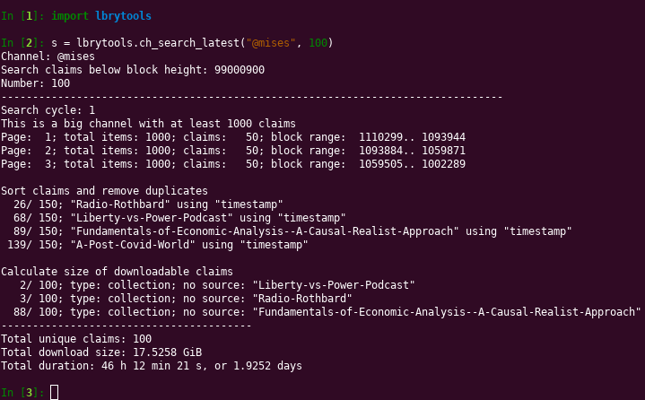
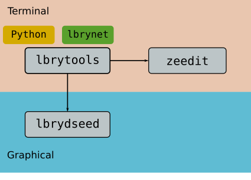

# lbrytools

A library of functions that can be used to manage the download of claims from
the LBRY network. It includes methods to download claims by
URI (canonical url), claim ID, or from specific channels.

It also includes methods to clean up older files and free space, so
the functions are suitable for use in a headless computer that will download
files, and seed them to the network with little user intervention.

This library is released as free software under the MIT license.



## Motivation

The [LBRY Desktop application](https://github.com/lbryio/lbry-desktop)
provides basic functionality to manage downloaded claims.
Real control of the system is achieved with the `lbrynet` headless
client, also called the [lbry-sdk](https://github.com/lbryio/lbry-sdk).

This library provides convenience functions that wrap around `lbrynet` in order
to search, download, and delete many claims easier.

This library is inspired by tuxfoo's [lbry-seedit](https://github.com/tuxfoo/lbry-seedit) script,
which provides basic functions, and a configuration file to download and seed
claims. Initially tuxfoo's code was extended slightly but eventually an entire
library was written from scratch to provide more functionality.

## Installation

You must have Python installed. Most Linux distributions come with Python
ready to use; for Windows you may need to get the official package,
or a full featured distribution such as Anaconda.
In Windows, make sure the Python executable is added to the `PATH`
so that it can be launched from anywhere in your system.

You must have the LBRY Desktop application or the `lbrynet` client.
Get them from [lbry.com/get](https://lbry.com/get).

## Requisites

This library was developed and tested with Python 3.8 but it may also work with
earlier versions with small changes.
It uses standard modules such as `importlib`, `os`, `random`, `regex`,
`sys`, and `time`.

The `requests` library is necessary to communicate
with the running LBRY daemon:
```sh
python -m pip install --user requests
python3 -m pip install --user requests  # for Ubuntu
```

You can install these and other libraries by using `pip`,
the Python package manager. If this is not installed it can be installed:
```sh
sudo apt install python-pip
sudo apt install python3-pip  # for Ubuntu
sudo pacman -S python-pip  # for Arch
```

### Updating

To update the library's code, make sure you are in the `lbrytools/` directory:
```sh
cd lbrytools/
git pull
```

If this causes merging errors you may have to update the code manually:
```sh
cd lbrytools/
git fetch
git reset --hard FETCH_HEAD
```

### System wide installation

This is optional, and only required if we want to have the library
available in our entire system.

Copy the `lbrytools` directory,
and place it inside a `site-packages` directory that is searched by Python.
This can be in the user's home directory,
```
/home/user/.local/lib/python3.8/site-packages/lbrytools
```

or in a system-wide directory:
```
/usr/local/lib/python3.8/dist-packages/lbrytools
/usr/lib/python3/dist-packages/lbrytools
```

Then the `lbrytools` package can be imported from anywhere in our system.

### Environmental variables

This is optional. Instead of moving the `lbrytools` package,
simply add it to the `PYTHONPATH` environmental variable.
We must add the parent directory containing this library.

For example, if
```
/top1/pkg/
    lbrytools/
```

The variable will be
```sh
PYTHONPATH="/top1/pkg:$PYTHONPATH"
```

### Optional

The `numpy` and `matplotlib` packages are optional; they are used
to create a plot with `print_blobs_ratio`.

The `emoji` package is optional; it is used to remove emojis from
strings that contain them.
```sh
python -m pip install --user emoji numpy matplotlib
python3 -m pip install --user emoji numpy matplotlib  # for Ubuntu
```

## Usage

Make sure the `lbrynet` daemon is running either by launching
the full LBRY Desktop application, or by starting the console `lbrynet`
program.
```sh
lbrynet start
```

Then open a Python console, import the module, and use its methods.
```py
import lbrytools as lbryt

lbryt.download_single(...)
lbryt.ch_download_latest(...)
lbryt.ch_download_latest_multi(...)
lbryt.redownload_latest(...)
lbryt.download_claims(...)
lbryt.print_summary()
lbryt.print_channels()
lbryt.delete_single(...)
lbryt.ch_cleanup(...)
lbryt.ch_cleanup_multi(...)
lbryt.remove_claims(...)
lbryt.measure_usage(...)
lbryt.cleanup_space(...)
lbryt.remove_media()
lbryt.count_blobs(...)
lbryt.count_blobs_all(...)
lbryt.analyze_blobs(...)
lbryt.download_missing_blobs(...)
lbryt.analyze_channel(...)
lbryt.print_channel_analysis(...)
lbryt.blobs_move(...)
lbryt.blobs_move_all(...)
lbryt.claims_bids(...)
lbryt.list_ch_subs(...)
lbryt.list_ch_subs_latest(...)
lbryt.list_accounts(...)
lbryt.list_channels(...)
lbryt.list_claims(...)
lbryt.list_playlists(...)
lbryt.list_supports(...)
lbryt.print_blobs_ratio(...)
lbryt.create_support(...)
lbryt.abandon_support(...)
lbryt.abandon_support_inv(...)
lbryt.target_support(...)
lbryt.print_trending_claims(...)
lbryt.print_search_claims(...)
lbryt.print_ch_claims(...)
lbryt.list_comments(...)
lbryt.create_comment(...)
lbryt.update_comment(...)
lbryt.abandon_comment(...)
lbryt.list_peers(...)
lbryt.list_ch_peers(...)
lbryt.list_ch_subs_peers(...)
lbryt.list_lbrynet_status(...)
lbryt.list_lbrynet_settings(...)
```

Read the [lbrytools.md](./lbrytools.md) file for a short explanation
on the most useful functions in the library.

## Submodule



This library can be used as a submodule in other projects,
for example,
[zeedit](https://github.com/belikor/zeedit)
and
[lbrydseed](https://github.com/belikor/lbrydseed).

To install this repository as a submodule in your own repository:
```sh
git submodule add https://github.com/belikor/lbrytools
```

Then in your `custom_project` you can clone and download the submodule at the same time:
```sh
git clone --recurse-submodules https://github.com/user/custom_project
```

Then, if needed, the submodule can be updated from the toplevel of the project:
```sh
cd custom_project
git submodule update --remote --rebase lbrytools/
```

If this causes merging errors we may have to update the submodule manually:
```
cd custom_project/lbrytools/
git fetch
git reset --hard FETCH_HEAD
```

## Development

Ideally, this collection of tools can be merged into the official
LBRY sources so that everybody has access to them without installing separate
programs.
Where possible, the tools should also be available from a graphical
interface such as the LBRY Desktop application.
* [lbryio/lbry-sdk](https://github.com/lbryio/lbry-sdk)
* [lbryio/lbry-desktop](https://github.com/lbryio/lbry-desktop)

If you wish to support this work you can send a donation:
```
LBC: bY38MHNfE59ncq3Ch3zLW5g41ckGoHMzDq
XMR: 8565RALsab2cWsSyLg4v1dbLkd3quc7sciqFJ2mpfip6PeVyBt4ZUbZesAAVpKG1M31Qi5k9mpDSGSDpb3fK5hKYSUs8Zff
```
